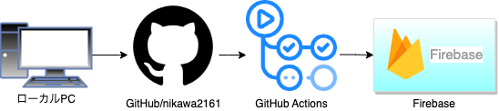

JS練習用
========

JSアプリの練習用になります。
PC版のスタイルのみになります。後々レスポンシブ対応致します。

## デプロイ

* URL
https://js-many-function.web.app/

## 使用技術

* 言語
HTML/CSS
JavaScript

* インフラ
Firebase

## JSアプリ
 1. [01convertTextToSpeech : 音声機能](01.md) 
 2. [02balanceBallGame : バランスボールゲーム](02.md) 

## 参考技術者
インスタで見かけた技術者が面白そうだったので、下記のかたを参考にしています。
本ソースコードは少し変更しています。
https://www.instagram.com/effective_dev/?igshid=YmMyMTA2M2Y%3D
